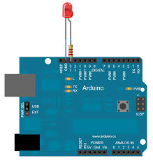
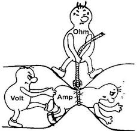

layout: true
class: center, middle

---

# Arduino and Electronics

---

# Maybe you're wondering
* What is Arduino?
* Why Arduino?
* How Arduino?

---

# arduino.cc says:
> Arduino is an open-source electronics prototyping platform based on flexible, easy to use hardware and software.
> It's intended for artists, designers, hobbyists and anyone interested in creating interactive objects or environments.

---

# Open-Source
* All of the software is free and on Github
* Hardware schematics and EAGLE files are also free


---

background-image: url(http://arduino.cc/en/uploads/Main/ArduinoSeverinoSchematic.png)

---

# Buy


~ $20

---

# Or DIY


---

# Electronics Prototyping Platform
* Based on Atmel microcontrollers
* Lower level hardware and software concerns are abstractred away
* Minimal API differences accross hardware


---

background-image: url(images/avr_block_diagram.png)

---

background-image: url(images/avr_assembly.png)

---

# Arduino isn't scary!

.left[```c
int led = 13;

void setup() {
  pinMode(led, OUTPUT);

void loop() {
  digitalWrite(led, HIGH);
  delay(1000);
  digitalWrite(led, LOW);
  delay(1000);
}
```]



---

# Where to Begin?
* http://arduino.cc/en/Guide/HomePage
* Straightforward and lots of pictures

---

# Wires and Stuff


---

background-image: url(http://yourduino.com/Photos/BreadBoard-1.jpg)

---

background-image: url(https://dlnmh9ip6v2uc.cloudfront.net/r/600-600/assets/6/8/6/d/1/51cdc767ce395f7558000002.png)

---

# Voltage, Current, Resistance, and Ohm's Law
## V = I * R



---

# Lets Avoid This

<iframe width="420" height="315" src="//www.youtube.com/embed/WLctUO1DGtw" frameborder="0" allowfullscreen></iframe>

---

# What Kind of Resistor Should We Use?


--

V = I * R

--

9 V - 2 V = 0.02 A * R

_(assume a 2 V drop across the LED)_

--

R = 7 V / 0.02 A

--

R = 350 Ω

---

# An LED Blinker

.left[```c
int led = 13;

void setup() {
  pinMode(led, OUTPUT);

void loop() {
  digitalWrite(led, HIGH);
  delay(1000);
  digitalWrite(led, LOW);
  delay(1000);
}
```]


---

background-image: url(http://arduino.cc/en/uploads/Tutorial/ExampleCircuit_sch.png)

---

# Why 220 Ω ?
## V = I * R
## 5 V - 2 V = I * 220 Ω
## I = 3 V /220 Ω
## I = 14 mA

---

# More Colors!


---

.left[```c
int redPin = 7;
int greenPin = 6;
int bluePin = 5;

void setup(){
  pinMode(redPin, OUTPUT);
  pinMode(greenPin, OUTPUT);
  pinMode(bluePin, OUTPUT);
  
  digitalWrite(redPin, LOW);
  digitalWrite(greenPin, LOW);
  digitalWrite(bluePin, LOW);
}

void loop(){
  digitalWrite(redPin, HIGH);
  delay(1000);
  digitalWrite(redPin, LOW);
  
  digitalWrite(greenPin, HIGH);
  delay(1000);
  digitalWrite(greenPin, LOW);
  
  digitalWrite(bluePin, HIGH);
  delay(1000);
  digitalWrite(bluePin, LOW);
}
```]

---

background-image: url(images/rgb_blinker_1.png)

---

# Selecting a Color


---


---

# Pull-Down Resistors
.left[
* Holds the logic signal near 0 V when no other active device is connected
* When not pressed, no connection:
```c
digitalRead(buttonPin); // LOW
```
* When pressed, 5 V:
```c
digitalRead(buttonPin); // HIGH
```
]

---

background-image: url(http://ba.protostack.com/2010/03/switch_debounce_04_lrg.jpg)

---

# Debouncing
* Can be done in hardware or software
* In software, detect the first input and ignore additional input for x ms


---

background-image: url(images/rgb_blinker_2.png)

---

.left[```c
int redPin = 9;
int greenPin = 10;
int bluePin = 11;

int buttonPin = 4;
int debounceDelay = 200;

unsigned long buttonLastPressed = 0;
int selectedColor = 9; // 9 for red, 10 for green, 11 for blue

void setup(){
  pinMode(redPin, OUTPUT);
  pinMode(greenPin, OUTPUT);
  pinMode(bluePin, OUTPUT);
  
  pinMode(buttonPin, INPUT);
  
  digitalWrite(redPin, LOW);
  digitalWrite(greenPin, LOW);
  digitalWrite(bluePin, LOW);
}

void loop(){
  if(digitalRead(buttonPin) == HIGH && millis() - buttonLastPressed > debounceDelay){
    selectedColor += 1;
    
    if(selectedColor > 11){
      selectedColor = 9;
    }
    buttonLastPressed = millis();
  }
  
  digitalWrite(redPin, LOW);
  digitalWrite(greenPin, LOW);
  digitalWrite(bluePin, LOW);
  
  digitalWrite(selectedColor, HIGH);
}
```]